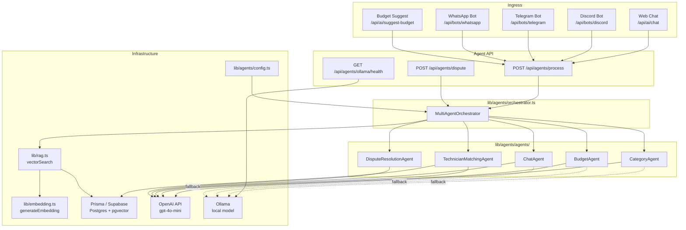
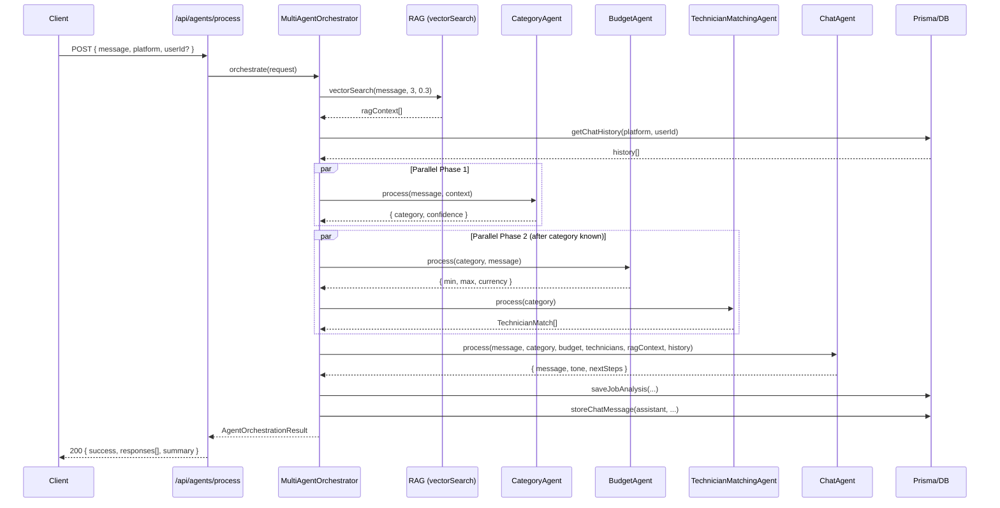
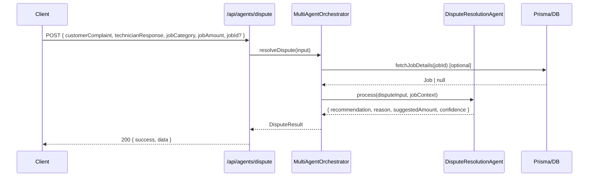

# Design Document: Multi-Agent System Enhancement

## Overview

Malaysia Co (Maintenance Services)'s current AI layer is a single monolithic function (`processUserQuery`) that sequentially executes categorisation, budget estimation, technician matching, and response generation — all in one blocking call. This design replaces it with a proper multi-agent architecture: five specialised agents coordinated by a central orchestrator that runs independent agents in parallel, supports a local Ollama fallback, and exposes clean REST endpoints consumed by the existing bot integrations and the web chat.

The refactor preserves full backward compatibility with `messaging-orchestrator.ts` (which becomes a thin adapter), the Vercel AI SDK chat route, and all three bot routes (Discord, Telegram, WhatsApp).

---

## Architecture



---

## Sequence Diagrams

### Main Request Flow (process endpoint)



### Dispute Resolution Flow



---

## Components and Interfaces

### MultiAgentOrchestrator

**Purpose**: Central coordinator. Runs RAG retrieval, fans out to agents (with parallelism where possible), aggregates results, persists analytics, and returns a unified response.

**Interface**:
```typescript
interface OrchestratorRequest {
  message: string
  platform: string
  userId?: string
  jobId?: string
  metadata?: Record<string, unknown>
}

interface AgentResponse<T = unknown> {
  agent: string
  success: boolean
  data: T
  error?: string
  durationMs: number
}

interface AgentOrchestrationResult {
  responses: AgentResponse[]
  summary: {
    totalAgents: number
    successfulAgents: number
    failedAgents: number
    totalDurationMs: number
  }
  // Convenience fields for backward-compat adapter
  answer: string
  category: string
  confidence: number
  budgetMin: number
  budgetMax: number
  currency: string
  suggested: TechnicianMatch[]
  ragContext: string[]
}

class MultiAgentOrchestrator {
  orchestrate(request: OrchestratorRequest): Promise<AgentOrchestrationResult>
  resolveDispute(input: DisputeInput): Promise<DisputeResult>
}
```

**Responsibilities**:
- Retrieve RAG context before dispatching agents
- Run CategoryAgent first (budget and matching depend on its output)
- Run BudgetAgent and TechnicianMatchingAgent in parallel after category is known
- Run ChatAgent last (needs all prior results)
- Catch per-agent errors and continue with degraded results
- Persist `JobAnalysis` and `ChatHistory` records

---

### CategoryAgent

**Purpose**: Classifies a free-text maintenance request into one of nine canonical categories.

**Interface**:
```typescript
interface CategoryInput {
  message: string
  ragContext?: string
}

interface CategoryOutput {
  category: JobCategory
  confidence: number   // 0.0 – 1.0
  reasoning: string
}

type JobCategory =
  | 'plumbing' | 'electrical' | 'ac' | 'carpentry'
  | 'painting' | 'cleaning' | 'appliance' | 'maintenance' | 'other'

class CategoryAgent {
  process(input: CategoryInput, ctx: AgentContext): Promise<AgentResponse<CategoryOutput>>
}
```

**Responsibilities**:
- Call AI model with a zero-temperature structured-output prompt
- Parse and validate JSON response
- Fall back to `'other'` with `confidence: 0.3` on parse failure

---

### BudgetAgent

**Purpose**: Estimates a fair INR price range for a job given its category and description.

**Interface**:
```typescript
interface BudgetInput {
  category: JobCategory
  message: string
}

interface BudgetOutput {
  min: number      // INR cents or whole rupees (consistent with Job.budget)
  max: number
  currency: 'INR'
  reasoning: string
}

class BudgetAgent {
  process(input: BudgetInput, ctx: AgentContext): Promise<AgentResponse<BudgetOutput>>
}
```

**Responsibilities**:
- Use category-specific default ranges as fallback
- Call AI model with `temperature: 0.2` for slight variation
- Validate that `min < max` and both are positive

---

### TechnicianMatchingAgent

**Purpose**: Queries the database for available technicians with matching skills, then uses AI to rank the top 3.

**Interface**:
```typescript
interface MatchingInput {
  category: JobCategory
  message: string
  location?: { lat: number; lng: number }
}

interface TechnicianMatch {
  userId: string
  name: string
  rating: number
  hourlyRate: number | null
  completedJobs?: number
  matchScore: number   // 0–100
  reason: string
}

class TechnicianMatchingAgent {
  process(input: MatchingInput, ctx: AgentContext): Promise<AgentResponse<TechnicianMatch[]>>
}
```

**Responsibilities**:
- Query `TechnicianProfile` where `skills has category` and `isAvailable = true`
- If no DB results, return empty array (no AI call)
- If results exist, call AI to rank and score top 3
- Fall back to top-3-by-rating on AI parse failure

---

### ChatAgent

**Purpose**: Generates a friendly, contextual conversational response that summarises the analysis for the user.

**Interface**:
```typescript
interface ChatInput {
  message: string
  category: JobCategory
  budget: BudgetOutput
  technicians: TechnicianMatch[]
  ragContext: string
  chatHistory: string
}

interface ChatOutput {
  message: string
  tone: 'friendly' | 'professional' | 'urgent'
  nextSteps: string[]
}

class ChatAgent {
  process(input: ChatInput, ctx: AgentContext): Promise<AgentResponse<ChatOutput>>
}
```

**Responsibilities**:
- Compose a system prompt that includes all prior agent outputs
- Use `temperature: 0.7` for natural language variation
- Return a static fallback string if AI call fails

---

### DisputeResolutionAgent

**Purpose**: Analyses a customer complaint and technician response for a completed job and recommends a fair resolution.

**Interface**:
```typescript
interface DisputeInput {
  customerComplaint: string
  technicianResponse: string
  jobCategory: JobCategory
  jobAmount: number   // INR
  jobId?: string
}

interface DisputeOutput {
  recommendation: 'full_refund' | 'partial_refund' | 'no_refund' | 'escalate'
  reason: string
  suggestedAmount: number   // INR, 0 for no_refund
  confidence: number
}

class DisputeResolutionAgent {
  process(input: DisputeInput, ctx: AgentContext): Promise<AgentResponse<DisputeOutput>>
}
```

**Responsibilities**:
- Evaluate both sides impartially
- Default to `'escalate'` on AI failure (safest outcome)
- Never suggest `suggestedAmount > jobAmount`

---

### AgentContext (shared)

```typescript
interface AgentContext {
  model: LanguageModel          // resolved OpenAI or Ollama model
  platform: string
  userId: string
  requestId: string             // nanoid for tracing
  logger: Logger
}
```

---

### OllamaIntegration

**Purpose**: Wraps the `ollama` npm package to provide a Vercel AI SDK-compatible `LanguageModel` for local inference.

**Interface**:
```typescript
interface OllamaConfig {
  baseURL: string    // default: http://localhost:11434
  model: string      // default: from OLLAMA_MODEL env
}

function createOllamaModel(config?: Partial<OllamaConfig>): LanguageModel
async function checkOllamaHealth(): Promise<{ status: 'healthy' | 'unavailable'; models: string[] }>
```

---

### AgentConfig

**Purpose**: Centralises all agent configuration, model selection, and feature flags.

**Interface**:
```typescript
interface AgentConfig {
  defaultModel: string           // 'openai/gpt-4o-mini'
  ollamaEnabled: boolean
  ollamaBaseURL: string
  ollamaModel: string
  logLevel: 'debug' | 'info' | 'warn' | 'error'
  maxChatHistoryItems: number    // default: 5
  ragMinSimilarity: number       // default: 0.3
  ragMaxDocs: number             // default: 3
}

function getAgentConfig(): AgentConfig
function resolveModel(config: AgentConfig): LanguageModel
```

---

## Data Models

### JobAnalysis (existing Prisma model — no schema change)

```typescript
// Stored after every orchestrate() call
interface JobAnalysisRecord {
  id: string
  query: string
  category: string
  budgetMin: number
  budgetMax: number
  currency: string          // 'INR'
  technicians: TechnicianMatch[]   // stored as JSON
  metadata: {
    platform: string
    userId: string
    confidence: number
    requestId: string
    agentDurations: Record<string, number>
    ragContext: Array<{ content: string; similarity: number }>
  }
  createdAt: Date
}
```

### ChatHistory (existing Prisma model — no schema change)

```typescript
interface ChatHistoryRecord {
  id: string
  platform: string
  userId: string
  role: 'user' | 'assistant'
  content: string
  metadata: { requestId?: string }
  createdAt: Date
}
```

### DisputeRecord (new — optional future addition)

```typescript
// Not in current schema; can be added as a new Prisma model
interface DisputeRecord {
  id: string
  jobId: string
  customerComplaint: string
  technicianResponse: string
  recommendation: string
  suggestedAmount: number
  confidence: number
  resolvedAt: Date
}
```

---

## Algorithmic Pseudocode

### Main Orchestration Algorithm

```pascal
ALGORITHM orchestrate(request)
INPUT: request of type OrchestratorRequest
OUTPUT: result of type AgentOrchestrationResult

BEGIN
  ASSERT request.message IS NOT EMPTY

  requestId ← nanoid()
  startTime ← now()
  responses ← []

  // Phase 0: Retrieve context (parallel, non-blocking for agents)
  ragContext ← vectorSearch(request.message, RAG_MAX_DOCS, RAG_MIN_SIMILARITY)
  chatHistory ← getChatHistory(request.platform, request.userId, MAX_HISTORY)

  // Store user message
  storeChatMessage(request.platform, request.userId, 'user', request.message)

  // Phase 1: Categorise (serial — budget and matching depend on this)
  catResponse ← CategoryAgent.process(
    { message: request.message, ragContext: formatContext(ragContext) },
    buildContext(requestId)
  )
  responses.append(catResponse)

  category ← catResponse.success ? catResponse.data.category : 'other'
  confidence ← catResponse.success ? catResponse.data.confidence : 0.3

  // Phase 2: Budget + Matching in parallel
  [budResponse, matchResponse] ← Promise.all([
    BudgetAgent.process({ category, message: request.message }, buildContext(requestId)),
    TechnicianMatchingAgent.process({ category, message: request.message }, buildContext(requestId))
  ])
  responses.append(budResponse, matchResponse)

  budget ← budResponse.success ? budResponse.data : DEFAULT_BUDGET[category]
  technicians ← matchResponse.success ? matchResponse.data : []

  // Phase 3: Generate chat response (serial — needs all prior results)
  chatResponse ← ChatAgent.process(
    {
      message: request.message,
      category,
      budget,
      technicians,
      ragContext: formatContext(ragContext),
      chatHistory
    },
    buildContext(requestId)
  )
  responses.append(chatResponse)

  answer ← chatResponse.success ? chatResponse.data.message : FALLBACK_ANSWER(category, budget)

  // Persist
  storeChatMessage(request.platform, request.userId, 'assistant', answer)
  saveJobAnalysis(request, category, budget, technicians, responses, requestId)

  totalDurationMs ← now() - startTime
  successCount ← COUNT(r IN responses WHERE r.success = true)

  RETURN {
    responses,
    summary: { totalAgents: 4, successfulAgents: successCount, failedAgents: 4 - successCount, totalDurationMs },
    answer, category, confidence,
    budgetMin: budget.min, budgetMax: budget.max, currency: budget.currency,
    suggested: technicians,
    ragContext: ragContext.map(d => d.content)
  }
END
```

**Preconditions:**
- `request.message` is a non-empty string
- Database connection is available
- At least one AI model (OpenAI or Ollama) is reachable

**Postconditions:**
- `responses` contains one entry per agent that was invoked
- `summary.successfulAgents + summary.failedAgents === summary.totalAgents`
- `JobAnalysis` record is persisted
- `ChatHistory` records for both user and assistant are persisted
- Result is backward-compatible with the legacy `QueryResult` shape

**Loop Invariants:** N/A (no loops in orchestration; parallel fan-out via `Promise.all`)

---

### CategoryAgent Processing Algorithm

```pascal
ALGORITHM CategoryAgent.process(input, ctx)
INPUT: input of type CategoryInput, ctx of type AgentContext
OUTPUT: AgentResponse<CategoryOutput>

BEGIN
  startTime ← now()

  TRY
    prompt ← buildCategoryPrompt(input.message, input.ragContext)

    { text } ← generateText({
      model: ctx.model,
      prompt,
      temperature: 0
    })

    parsed ← JSON.parse(text.trim())

    ASSERT parsed.category IN VALID_CATEGORIES
    ASSERT 0.0 <= parsed.confidence <= 1.0

    RETURN {
      agent: 'CategoryAgent',
      success: true,
      data: { category: parsed.category, confidence: parsed.confidence, reasoning: parsed.reasoning ?? '' },
      durationMs: now() - startTime
    }

  CATCH parseError
    ctx.logger.warn('CategoryAgent parse failure', { error: parseError })
    RETURN {
      agent: 'CategoryAgent',
      success: false,
      data: { category: 'other', confidence: 0.3, reasoning: 'parse failure' },
      error: parseError.message,
      durationMs: now() - startTime
    }
  END TRY
END
```

**Preconditions:**
- `input.message` is non-empty
- `ctx.model` is a valid LanguageModel instance

**Postconditions:**
- Always returns an `AgentResponse` (never throws)
- On success: `data.category` is one of the nine valid categories
- On failure: `data.category === 'other'`, `success === false`

---

### Parallel Execution Algorithm

```pascal
ALGORITHM runParallel(agentTasks[])
INPUT: agentTasks — array of () => Promise<AgentResponse>
OUTPUT: AgentResponse[]

BEGIN
  // Wrap each task to catch individual failures
  safeTasks ← agentTasks.map(task =>
    task().catch(err => ({
      agent: 'unknown',
      success: false,
      data: null,
      error: err.message,
      durationMs: 0
    }))
  )

  results ← await Promise.all(safeTasks)

  RETURN results
END
```

**Preconditions:**
- `agentTasks` is a non-empty array of async functions

**Postconditions:**
- Returns exactly `agentTasks.length` results
- No individual agent failure propagates to others
- All results are settled (no pending promises)

**Loop Invariants:** N/A

---

### Model Resolution Algorithm

```pascal
ALGORITHM resolveModel(config)
INPUT: config of type AgentConfig
OUTPUT: LanguageModel

BEGIN
  IF config.ollamaEnabled = true THEN
    health ← checkOllamaHealth()

    IF health.status = 'healthy' THEN
      RETURN createOllamaModel({ baseURL: config.ollamaBaseURL, model: config.ollamaModel })
    ELSE
      logger.warn('Ollama unavailable, falling back to OpenAI')
    END IF
  END IF

  RETURN openai(config.defaultModel)
END
```

**Preconditions:**
- `OPENAI_API_KEY` is set in environment (fallback path)

**Postconditions:**
- Returns a valid `LanguageModel` instance
- If Ollama is enabled but unavailable, OpenAI is used without error

---

## Key Functions with Formal Specifications

### `orchestrate(request: OrchestratorRequest): Promise<AgentOrchestrationResult>`

**Preconditions:**
- `request.message.length > 0`
- `request.platform` is one of `'web' | 'discord' | 'telegram' | 'whatsapp'`
- Database is reachable

**Postconditions:**
- Returns `AgentOrchestrationResult` with `responses.length >= 1`
- `summary.totalAgents === 4` (Category, Budget, Matching, Chat)
- `answer` is a non-empty string
- `category` is a valid `JobCategory`
- `budgetMin <= budgetMax`

---

### `resolveDispute(input: DisputeInput): Promise<DisputeResult>`

**Preconditions:**
- `input.customerComplaint.length > 0`
- `input.technicianResponse.length > 0`
- `input.jobAmount > 0`

**Postconditions:**
- `recommendation` is one of `'full_refund' | 'partial_refund' | 'no_refund' | 'escalate'`
- `suggestedAmount <= input.jobAmount`
- `suggestedAmount >= 0`
- On AI failure: `recommendation === 'escalate'`

---

### `processUserQuery(message, platform, userId): Promise<QueryResult>` (legacy adapter)

**Preconditions:** Same as `orchestrate`

**Postconditions:**
- Returns the same `QueryResult` shape as the original monolithic function
- Internally delegates to `MultiAgentOrchestrator.orchestrate()`
- No behaviour change visible to callers (Discord, Telegram, WhatsApp bots)

---

## Example Usage

```typescript
// 1. Direct orchestrator usage (new API endpoint)
import { MultiAgentOrchestrator } from '@/lib/agents/orchestrator'

const orchestrator = new MultiAgentOrchestrator()

const result = await orchestrator.orchestrate({
  message: 'My kitchen sink has been leaking for a week',
  platform: 'web',
  userId: 'user_abc123',
})

console.log(result.category)        // 'plumbing'
console.log(result.budgetMin)       // 500
console.log(result.budgetMax)       // 3000
console.log(result.suggested[0])    // { name: 'Ravi Kumar', rating: 4.8, matchScore: 95, ... }
console.log(result.answer)          // 'Great news! I found 3 plumbers available...'

// 2. Dispute resolution
const dispute = await orchestrator.resolveDispute({
  customerComplaint: 'The technician left without fixing the pipe fully',
  technicianResponse: 'Customer asked me to stop after 30 minutes',
  jobCategory: 'plumbing',
  jobAmount: 1500,
  jobId: 'job_xyz789',
})

console.log(dispute.recommendation)   // 'partial_refund'
console.log(dispute.suggestedAmount)  // 750

// 3. Legacy adapter (backward-compat — no changes needed in bot routes)
import { processUserQuery } from '@/lib/agents/messaging-orchestrator'

const legacy = await processUserQuery('AC not cooling', 'discord', 'discord_user_123')
// Returns same QueryResult shape as before

// 4. Individual agent usage (for testing or custom flows)
import { CategoryAgent } from '@/lib/agents/agents/category-agent'
import { getAgentConfig, resolveModel } from '@/lib/agents/config'

const config = getAgentConfig()
const agent = new CategoryAgent()
const ctx: AgentContext = {
  model: resolveModel(config),
  platform: 'web',
  userId: 'test',
  requestId: 'req_001',
  logger: console,
}

const catResult = await agent.process({ message: 'Lights flickering in bedroom' }, ctx)
// { agent: 'CategoryAgent', success: true, data: { category: 'electrical', confidence: 0.92, ... } }
```

---

## Error Handling

### Agent Failure (individual)

**Condition**: An agent's AI call throws or returns unparseable JSON.
**Response**: The agent catches the error internally, sets `success: false`, and returns a safe default value.
**Recovery**: The orchestrator continues with the degraded value. The `summary.failedAgents` counter is incremented. The final response is still returned to the client.

### All Agents Fail

**Condition**: Every agent returns `success: false` (e.g., OpenAI outage and Ollama unavailable).
**Response**: The orchestrator returns a static fallback `answer` built from category defaults.
**Recovery**: Client receives a 200 with `summary.failedAgents === 4` — the frontend can display a generic message.

### Database Unavailable

**Condition**: Prisma throws on `vectorSearch`, `getChatHistory`, or `saveJobAnalysis`.
**Response**: RAG context is empty string; chat history is empty; analytics write is skipped with a logged warning.
**Recovery**: Agents still run with reduced context. The request does not fail.

### Ollama Unavailable

**Condition**: `checkOllamaHealth()` returns `status: 'unavailable'`.
**Response**: `resolveModel()` falls back to OpenAI silently.
**Recovery**: Transparent to agents and callers.

### Invalid Request Body

**Condition**: `POST /api/agents/process` receives a body missing `message`.
**Response**: Zod validation at the route level returns `400 { error: 'Invalid request', details: [...] }`.
**Recovery**: Client must fix the request.

---

## Testing Strategy

### Unit Testing Approach

Each agent class is tested in isolation by injecting a mock `AgentContext` with a stubbed `model`. Tests cover:
- Happy path: valid AI response parsed correctly
- Parse failure: malformed JSON → fallback values returned, `success: false`
- Empty input edge cases

### Property-Based Testing Approach

**Property Test Library**: fast-check

Key properties to verify:

1. **Orchestrator always returns a result** — for any non-empty message string, `orchestrate()` resolves (never rejects), and `summary.successfulAgents + summary.failedAgents === summary.totalAgents`.

2. **Budget invariant** — for any category and message, `budgetMin <= budgetMax` and both are positive integers.

3. **Category exhaustiveness** — for any message, the returned `category` is always one of the nine valid `JobCategory` values.

4. **Dispute amount invariant** — for any `jobAmount > 0`, `suggestedAmount >= 0 && suggestedAmount <= jobAmount`.

5. **Parallel execution isolation** — injecting a failing agent does not cause other agents to fail or the orchestrator to throw.

### Integration Testing Approach

- End-to-end test against a test database: POST to `/api/agents/process`, verify `JobAnalysis` and `ChatHistory` records are created.
- Bot adapter test: call `processUserQuery()` and verify the returned shape matches the legacy `QueryResult` interface exactly.
- Dispute endpoint test: POST to `/api/agents/dispute`, verify recommendation is one of the four valid values.

---

## Performance Considerations

- **Parallel Phase 2**: BudgetAgent and TechnicianMatchingAgent run concurrently via `Promise.all`, reducing total latency by ~40–60% compared to the sequential monolith.
- **RAG retrieval**: `vectorSearch` runs before agent fan-out and is I/O-bound (pgvector cosine search). The 384-dim all-MiniLM-L6-v2 model is cached in memory after first load (`embedder` singleton in `embedding.ts`).
- **Ollama local inference**: Eliminates OpenAI round-trip latency for high-volume bot traffic. Suitable for CategoryAgent and BudgetAgent which use structured zero-temperature prompts.
- **Chat history limit**: Capped at 5 messages (`MAX_HISTORY`) to keep prompt tokens bounded.
- **Vercel function timeout**: `maxDuration = 30` on the process route. The parallel phase keeps total time well within this limit for typical requests.

---

## Security Considerations

- **Authentication**: `/api/agents/process` and `/api/agents/dispute` require a valid Supabase session cookie (same as existing routes). The dispute endpoint additionally checks that the requesting user is the customer or technician on the job.
- **Input validation**: All route handlers use Zod schemas to validate and sanitise request bodies before passing to the orchestrator.
- **Prompt injection**: User messages are inserted into prompts as quoted strings, not as raw template interpolation. The AI model is instructed to output only JSON, limiting the attack surface.
- **Ollama network exposure**: `OLLAMA_BASE_URL` defaults to `localhost:11434`. It must not be exposed to the public internet. The health endpoint returns model names but no credentials.
- **API key handling**: `OPENAI_API_KEY` is read server-side only; never exposed to the client bundle.

---

## Dependencies

| Package | Version | Purpose |
|---|---|---|
| `ai` | ^6.0.182 | Vercel AI SDK — `generateText`, `streamText`, `LanguageModel` |
| `@ai-sdk/openai` | ^3.0.63 | OpenAI provider for AI SDK |
| `ollama` | ^0.6.3 | Ollama client for local model inference |
| `@xenova/transformers` | ^2.17.2 | Local embedding generation (all-MiniLM-L6-v2) |
| `@prisma/client` | ^7.8.0 | Database ORM (Postgres + pgvector) |
| `zod` | ^4.4.3 | Runtime schema validation for API routes |
| `nanoid` | ^5.1.11 | Request ID generation for tracing |

All dependencies are already present in `package.json`. No new packages are required.

---

## Correctness Properties

The following properties must hold for all valid inputs. They map directly to the property-based tests described in the Testing Strategy section.

### Property 1: Orchestrator Totality

For all non-empty message strings `m` and valid platform values `p`, `orchestrate({ message: m, platform: p })` always resolves to an `AgentOrchestrationResult` and never rejects.

**Validates: Requirements 1.1**

### Property 2: Agent Count Invariant

For all orchestration results `r`, `r.summary.successfulAgents + r.summary.failedAgents === r.summary.totalAgents === 4`.

**Validates: Requirements 1.2**

### Property 3: Category Validity

For all orchestration results `r`, `r.category ∈ { 'plumbing', 'electrical', 'ac', 'carpentry', 'painting', 'cleaning', 'appliance', 'maintenance', 'other' }`.

**Validates: Requirements 2.1**

### Property 4: Budget Ordering

For all orchestration results `r`, `r.budgetMin > 0 ∧ r.budgetMax > 0 ∧ r.budgetMin ≤ r.budgetMax`.

**Validates: Requirements 3.1**

### Property 5: Answer Non-Empty

For all orchestration results `r`, `r.answer.length > 0`.

**Validates: Requirements 5.1**

### Property 6: Dispute Amount Bounds

For all dispute inputs `d` where `d.jobAmount > 0`, the result satisfies `0 ≤ result.suggestedAmount ≤ d.jobAmount`.

**Validates: Requirements 6.1**

### Property 7: Dispute Recommendation Validity

For all dispute results `r`, `r.recommendation ∈ { 'full_refund', 'partial_refund', 'no_refund', 'escalate' }`.

**Validates: Requirements 6.2**

### Property 8: Agent Isolation

For all orchestration calls where one agent throws an unhandled exception, the remaining agents still execute and the orchestrator still returns a result (no exception propagation across agents).

**Validates: Requirements 1.3**

### Property 9: Legacy Adapter Compatibility

For all inputs `(message, platform, userId)`, `processUserQuery(message, platform, userId)` returns a value that satisfies the `QueryResult` interface: `{ answer: string, category: string, confidence: number, budgetMin: number, budgetMax: number, currency: string, suggested: TechnicianMatch[], ragContext: string[] }`.

**Validates: Requirements 7.1**

### Property 10: Parallel Idempotence

Running BudgetAgent and TechnicianMatchingAgent sequentially vs. in parallel produces results with the same shape and valid values (though AI-generated content may differ due to model non-determinism).

**Validates: Requirements 11.2**
